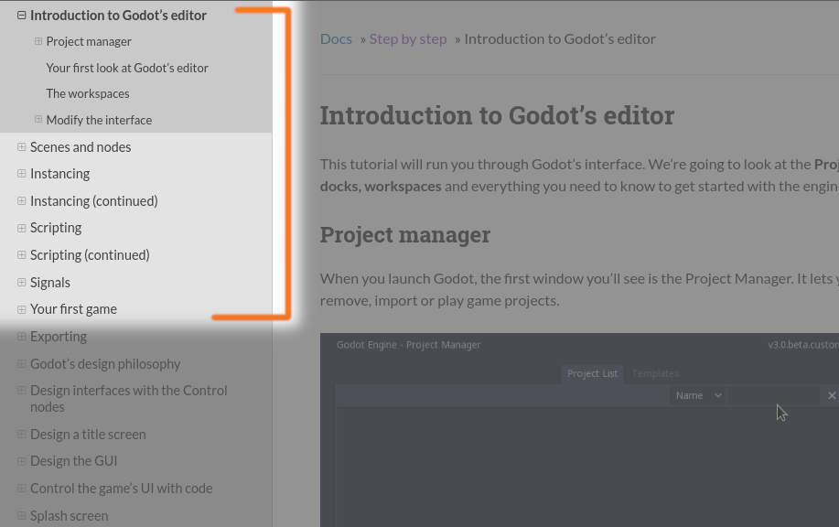
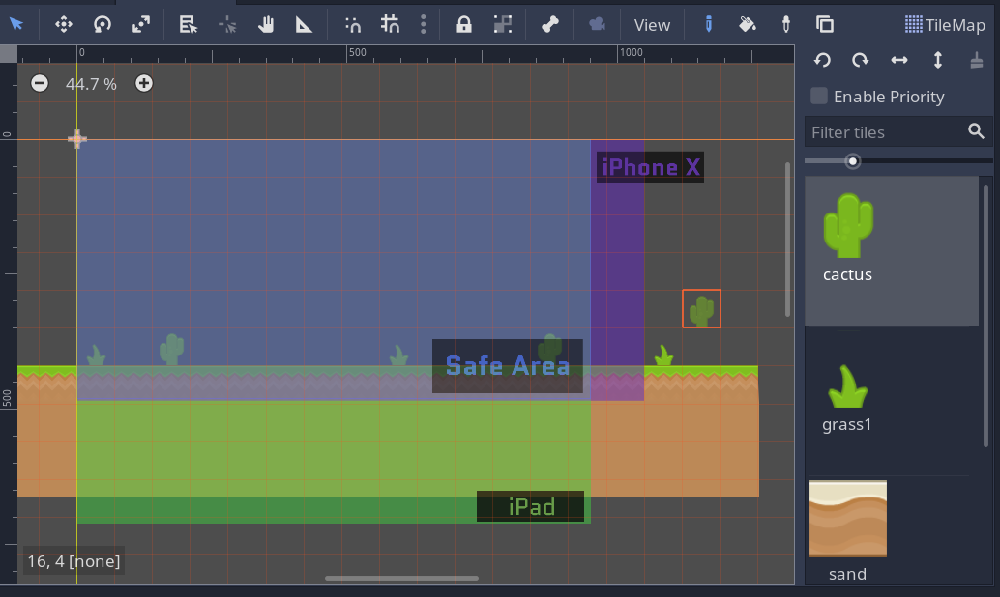
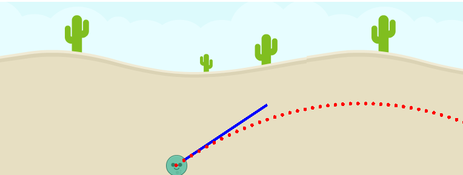

---

- [Godot 3.2 - Tutorial - Creating a mobile game](#godot-32---tutorial---creating-a-mobile-game)
  - [Where are the tutorials?](#where-are-the-tutorials)
  - [Prerequisites](#prerequisites)
  - [Contents](#contents)
    - [1. Introduction](#1-introduction)
    - [2. Configure Godot and Android SDK](#2-configure-godot-and-android-sdk)
    - [3. Testing performances on the smartphone](#3-testing-performances-on-the-smartphone)
    - [4. Touchscreen input with `_input()` and `InputEvents`](#4-touchscreen-input-with-_input-and-inputevents)
    - [5. Creating a game level](#5-creating-a-game-level)
    - [6. Projectile & Enemies](#6-projectile--enemies)
    - [7. Implementing the `Slingshot`](#7-implementing-the-slingshot)
    - [8. Calculating and drawing the trajectory](#8-calculating-and-drawing-the-trajectory)
    - [9. TODO - Obstacles](#9-todo---obstacles)
    - [10. TODO - Score system & Obstacles](#10-todo---score-system--obstacles)
    - [11. TODO - Camera](#11-todo---camera)
    - [12. TODO - Debugging a mobile App](#12-todo---debugging-a-mobile-app)
    - [13. TODO - Possible game improvements](#13-todo---possible-game-improvements)
  - [What now?](#what-now)
  - [Credits](#credits)
  - [Thanks](#thanks)
  - [Support me](#support-me)

# Godot 3.2 - Tutorial - Creating a mobile game

This repository contains a work in progress game inspidred by **Angry Birds**, reimplemented with Godot Engine 3.2.

Source code is MIT licensed. Feel free to read it, modify it and reuse it in your projects.

## Where are the tutorials?

Video tutorials will be released [on YouTube](https://www.youtube.com/c/CrystalBit) but the commentary is only in Italian.

Source code and comments are in English, and **I'm thinking about creating English written tutorials**. 
If you would like to see them please leave a like/comment [here](https://github.com/crystal-bit/angry-aliens/issues/1).

## Prerequisites

The tutorials require basic Godot understanding about Scenes, GDScript, 2D Nodes such as Sprite2D, CollisionShape2D, Area2D.

You can learn these topics by:

- reading the [official documentation](https://docs.godotengine.org/en/3.1/getting_started/step_by_step/intro_to_the_editor_interface.html)
- following my [video tutorial series](https://www.youtube.com/watch?v=AY1zuH2mHQ0&list=PLaCq3HqKQR6rlPpf2GAOXp52ddt0V71Yl) on Godot 3 basics (*only in Italian*)

Essentially you need to know these topics:

## Contents

### 1. Introduction

- 🎥 [YouTube video tutorial ITA](https://youtu.be/x0emyyXC_sM)

This tutorial series will focus on creating a simple mobile game
using Godot 3.2.

Currently I don't have an Apple device and I cannot develop/test iOS/OSX games.

I choose to make an Angry Birds clone because:

1. it is short to recreate (without adding polish) 
2. it allows to stress Godot performances on the worst case scenario: intense game (physics based) on a low-power device (smartphone)

I'm creating this tutorials using Manjaro Linux (Arch Linux derivative), but similar steps can be done on other operating systems as well.

I'll try to provide instructions for other OS, but help here is really appreciated (especially if you are a Debian, Ubuntu, Windows or OSX user)

### 2. Configure Godot and Android SDK

> How do I configure my computer for Android development?

- Install `android-tools` and `jdk-openjdk`
- Create debug keystore
- Configure Godot
- Download export templates
- [Bonus] Python script for automtic Godot/Android setup
- **Create the first APK**
  - Install the APK manually from the phone
  - Install the APK from command line using `adb`
  - Install the APK from Godot with one click
- Export a simple scene to the device

### 3. Testing performances on the smartphone

> If we include all the physics elements and we create hundreds of game objects, is the game playable?

1. Create a stress test scene
2. Add background sprites, tilemap
3. Add physics objects: enemies, static bodies, rigid bodies
4. Create an object spawner script 
5. Create a FPS graphic overlay

### 4. Touchscreen input with `_input()` and `InputEvents`

- Detect the touch position
- Detect drag
- Detect release
- Difference between `_input()` and `on_<CollisionObject2D>_input_event()` ?
- Simulate touch with mouse for faster development

### 5. Creating a game level

- `TileMap`, background and collisions
- Layout for mobile games
- Taking multiple resolutions into account
- How to force landscape/portrait

### 6. Projectile & Enemies

- Game objects with `Sprite`, `RigidBody` and `CollisionShape`
- Basic Physics concepts
- Mass, gravity and Godot Physics

### 7. Implementing the `Slingshot`

- Grab mechanig
  - Skeleton Mesh deform?
- Elastic force
- Take the Projectile as input with `export` keyword
- Launch the projectile

### 8. Calculating and drawing the trajectory

- Create a `TrajectoryDrawer` node
- Basic Physics concepts
- Measurement unit, velocity, impulse vs force
  -  https://en.wikipedia.org/wiki/Impulse_(physics)
- Projectile motion
- `_draw` method
- Is the trajectory correct?
  - Set the correct damping factor

### 9. TODO - Obstacles

- Create an obstacle
- Add obstacles to the level
- Implement obstacle destruction

### 10. TODO - Score system & Obstacles 

- Scores
  - https://www.macobserver.com/tmo/article/angry_birds_the_all-purpose_guide_to_three_stars_part_1
- Detect when the game is over
- Create and show end-game screen

### 11. TODO - Camera 

- Camera pan across the level
- Pinch to zoom
- Is input broken? Adjust it with `get_viewport_transform().get_origin()`
  
### 12. TODO - Debugging a mobile App

> How to debug errors and performances on a mobile device?

- Remote debugger
- https://stackoverflow.com/questions/6854127/filter-logcat-to-get-only-the-messages-from-my-application-in-android

### 13. TODO - Possible game improvements

- Gameplay flow: allow user to fire 3 projectiles per level
- Add audio sfx
- Improve the slingshot

## What now?

This tutorial covers only a small subset of mobile game development topics.

There are a lot of areas that can be explored, like:

- Deploying on Google Play Store
- Responsive layout
- Responsive gameplay
- Double tap, drag 'n drop, panning, pinch to zoom,...
- Using Sensors (GPS, accelerometer, light sensor, ...)
- Bluetooth
- ...

Some of these topics may be covered on [my YouTube channel](https://www.youtube.com/c/CrystalBit)
as separated videos.

Keep an eye on the [Crystal Bit Github organization](https://github.com/crystal-bit) as well, because
all the source code for my tutorials will be uploaded here.

## Credits

- Kenney for the game assets https://www.kenney.nl/

## Thanks

- My community for the support on YouTube, Telegram and in person 🙋
- Gameloop.it community for the Harvard [CS50 gamedev course](https://github.com/GameLoop-it/cs50_course_materials)
- [YouAreUto](http://youareuto.com/) game & team - My first mobile game as a freelance game developer
- Godot Engine community for the excellent documentation and software 
- [Godot Engine Italia](https://godotengineitalia.com/) 🍕

## Support me

I love creating free game projects and tutorials. If you want to help me, I really appreciate! You can:

- Star this repository
- Test the game and report issues
- Open PRs (please get in touch before)
- Retweet the project
- Talk to your friends about this project

Right now I don't have any donation page setup. If you are considering this, feel free to reach me out on vitrumbit@gmail.com
